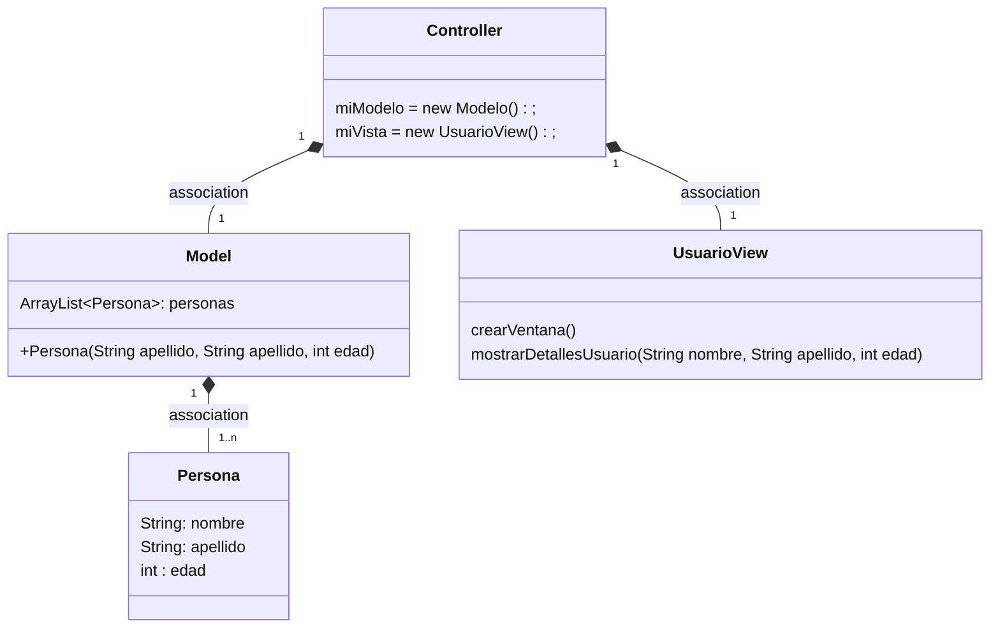
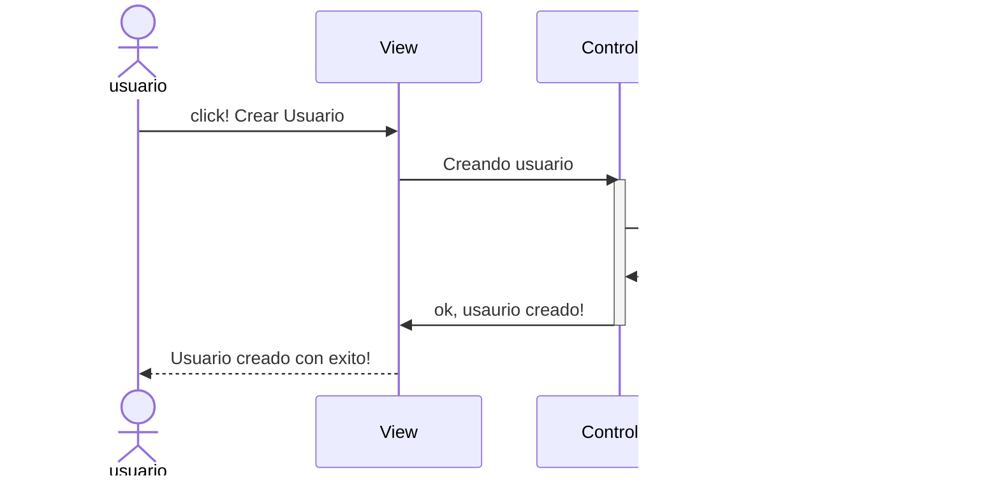

## Diagrama de clases:

```mermaid
classDiagram
    class Persona {
        String: nombre
        String: apellido
        int : edad
       
    }
      class Controller{
        miModelo = new Modelo();
        miVista = new UsuarioView();
      }
   
      class Model {
          ArrayList~Persona~: personas
          +Persona(String apellido, String apellido, int edad)
         
      }
      
     class UsuarioView { crearVentana() }
     class UsuarioView {mostrarDetallesUsuario(String nombre, String apellido, int edad)}
    Controller "1" *-- "1" Model : association
    Model "1" *-- "1..n" Persona : association
    Controller "1" *-- "1" UsuarioView : association
    
      
```

```mermaid

sequenceDiagram
    actor usuario
    participant View
    participant Controller
    participant Model
    
    usuario->>View: click! Crear Usuario
    View->>Controller: Creando usuario
    activate Controller
    Controller->>Model: crea un usuario, porfa
    activate Model
    Model-->>Controller: Persona
    deactivate Model
    Controller->>View: ok, usaurio creado!
    deactivate Controller
    View-->>usuario: Usuario creado con exito!
    
     
```